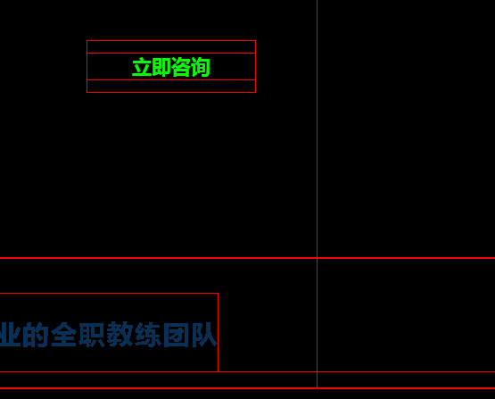

### 浮动
父亲亲加上了overflow:hidden；那么这个父亲就能够被浮动的儿子撑出高度了。这个现象，不能解释，就是浏览器的偏方。 并且,overflow:hidden;能够让margin生效。

### margin
- 在标准流中 相邻盒子上下margin会重叠，以大的一方为基准
- 盒子定高时使用 margin：0 auto；只能用于标准流


### 定位
#### 相对定位
1. 相对定位不脱标
相对定位：相对定位的真实位置还在老家，只不过影子出去了，可以到处飘。
2. 如果想做“压盖”效果（把一个div放到另一个div之上），我们一般不用相对定位来做。相对定位，就两个作用：
    - （1）微调元素
    - （2）做绝对定位的参考，子绝父相

#### 绝对定位

**绝对定位的盒子脱离了标准文档流。**

绝对定位：定义横纵坐标。原点在父容器的左上角**或**左下角。横坐标用left表示，纵坐标用top或者bottom表示。
1. 如果用top描述，那么参考点就是页面的左上角
2. 如果用bottom描述，那么参考点就是浏览器首屏窗口尺寸（好好理解“首屏”二字），对应的页面的左下角

# 锚点
1. 使用 a 标签锚点滚动到指定位置事，是使用 hash 在链接末尾添加一个 #name
>缺点在于会改变当前url，例如会和vue的hash路由产生冲突(vue-router 有替代滚动方案)
```html
<a href="#anchor">点击我滚动到锚点</a>
<a name="anchor">锚点</a>
```

2. 使用js

[参考链接](https://developer.mozilla.org/zh-CN/docs/Web/API/Element/scrollIntoView)
>不会改变url
```html
<div id="anchor">锚点</div>
<script >
document.getElementById("#anchor").scrollIntoView();  //scrollIntoView 参数可以控制滚动效果   
</script>
```

# 多个单行文字内容自适应宽度，居中显示 

```html
<div>
    <p>asdf</p>
    <p>asdfas</p>
</div>
<div>
    <p>asdfas</p>
    <p>asdfa</p>
</div>
<style>
.div {
   text-align: center;  // div所在行总体居中
}

.div p {
   display: inline-block;  //可以使得内容自适应宽度
}
</style>
```


### 兄弟选择器 ‘+’ 配合  margin-left，可轻松时间等间距分割

# 全局font-size会影响表单input间距
父级元素添加 font-size属性消除或input使用flex可以消除

# absolute 绝对定位是相对定位时相对于第一个设置为 relative 的父元素定位

# 快速调试代码
页面右侧出现大量空白，使用如下方法找出溢出元素限制宽度修复bug 
```css
* {
    background: #000 !important;
    color: #0f0 !important;
    outline: solid #f00 1px !important;
}
```
>使用效果如下



# input, select 的默认盒子模型不一样
```css
input, select{
    /*统一input 和select默认样式，避免宽度和高度不一致*/
    box-sizing: border-box;
}
```

# 如何让 fixed 超出部分滚动

```css
.fixed{
    position: fixed;
    top: 0;
    bottom: 0;
    overflow-y: scroll;
}
```

# 单词间距与字符间距
```css
.text {
    /*字符间有空格有效*/
    word-spacing: 0.05rem;
    /*对单个中文字或者英文字母起效*/
    letter-spacing: 0.05rem;
}

```