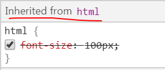
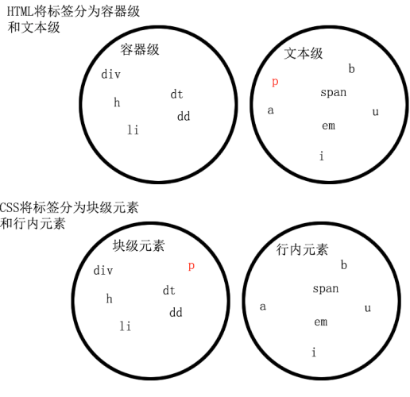
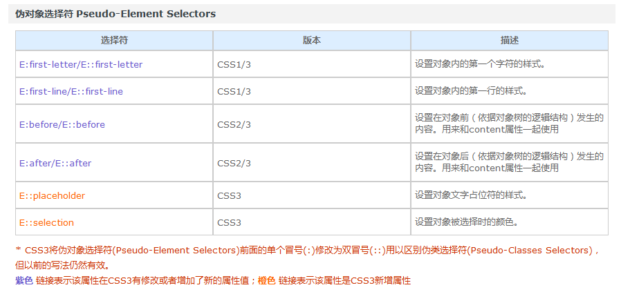
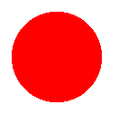
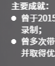

### 浮动
父亲亲加上了overflow:hidden；那么这个父亲就能够被浮动的儿子撑出高度了。这个现象，不能解释，就是浏览器的偏方。 并且,overflow:hidden;能够让margin生效。

### margin
- 在标准流中 相邻盒子上下margin会重叠，以大的一方为基准
- 盒子定高时使用 margin：0 auto；只能用于标准流


### 定位
#### 相对定位
1. 相对定位不脱标
相对定位：相对定位的真实位置还在老家，只不过影子出去了，可以到处飘。
2. 如果想做“压盖”效果（把一个div放到另一个div之上），我们一般不用相对定位来做。相对定位，就两个作用：
    - （1）微调元素
    - （2）做绝对定位的参考，子绝父相

#### 绝对定位

**绝对定位的盒子脱离了标准文档流。**

绝对定位：定义横纵坐标。原点在父容器的左上角**或**左下角。横坐标用left表示，纵坐标用top或者bottom表示。
1. 如果用top描述，那么参考点就是页面的左上角
2. 如果用bottom描述，那么参考点就是浏览器首屏窗口尺寸（好好理解“首屏”二字），对应的页面的左下角

# 锚点
1. 使用 a 标签锚点滚动到指定位置事，是使用 hash 在链接末尾添加一个 #name
>缺点在于会改变当前url，例如会和vue的hash路由产生冲突(vue-router 有替代滚动方案)
```html
<a href="#anchor">点击我滚动到锚点</a>
<a name="anchor">锚点</a>
```

2. 使用js

[参考链接](https://developer.mozilla.org/zh-CN/docs/Web/API/Element/scrollIntoView)
>不会改变url
```html
<div id="anchor">锚点</div>
<script >
document.getElementById("#anchor").scrollIntoView();  //scrollIntoView 参数可以控制滚动效果   
</script>
```

# 多个单行文字内容自适应宽度，居中显示 

```html
<div>
    <p>asdf</p>
    <p>asdfas</p>
</div>
<div>
    <p>asdfas</p>
    <p>asdfa</p>
</div>
<style>
.div {
   text-align: center;  // div所在行总体居中
}

.div p {
   display: inline-block;  //可以使得内容自适应宽度
}
</style>
```


### 兄弟选择器 ‘+’ 配合  margin-left，可轻松时间等间距分割

# 全局font-size会影响表单input间距
父级元素添加 font-size属性消除或input使用flex可以消除

# absolute 绝对定位是相对定位时相对于第一个设置为 relative 的父元素定位

# 快速调试代码
页面右侧出现大量空白，使用如下方法找出溢出元素限制宽度修复bug 
```css
* {
    background: #000 !important;
    color: #0f0 !important;
    outline: solid #f00 1px !important;
}
```
>使用效果如下


# input, select 的默认盒子模型不一样
```css
input, select{
    /*统一input 和select默认样式，避免宽度和高度不一致*/
    box-sizing: border-box;
}
```

# 如何让 fixed 超出部分滚动

```css
.fixed{
    position: fixed;
    top: 0;
    bottom: 0;
    overflow-y: scroll;
}
```

# 单词间距与字符间距
```css
.text {
    /*字符间有空格有效*/
    word-spacing: 0.05rem;
    /*对单个中文字或者英文字母起效*/
    letter-spacing: 0.05rem;
}

```

# 去掉input标签type=number时出现的箭头
```css
input::-webkit-outer-spin-button,
input::-webkit-inner-spin-button {
    -webkit-appearance: none;
}
 
input[type="number"] {
    -moz-appearance: textfield;
}
```
# css3使用 transform 出现字体模糊的解决办法
[参考链接](https://juejin.im/post/5ab1fbd6518825557b4c9f5d)
使用 element-ui时 轮播使用 transform 轮播实现，
轮播切换时意外导致了页面部分字体元素模糊抖动的情况
transform: translateZ(0); #可以去掉抖动
z-index: 1 可以解决字体模糊的问题

# css3 placeholder 字体颜色大小
```css
::-webkit-input-placeholder { /* WebKit browsers */
  color: #999;
  font-size: 16px;
}

::-moz-placeholder { /* Mozilla Firefox 19+ */
  color: #999;
  font-size: 16px;
}

:-ms-input-placeholder { /* Internet Explorer 10+ */
  color: #999;
  font-size: 16px;
} 
```  

#样式继承性 
* 关于文字样式的属性，都具有继承性。这些属性包括：color、 text-开头的、line-开头的、font-开头的。
* 关于盒子、定位、布局的属性，都不能继承。

chrome 中点击Inherited from *** 即可快速定位属性继承源



**!important无法提升继承的权重**
# 行内元素和块级元素

**行内元素无法设置高宽**



## 浮动
1. 一旦设置为浮动之后，即使不转成块级元素，也能够设置宽高了。
2. 所有标签，浮动之后，已经不区分行内、块级了
3. 标准流中的文字不会被浮动的盒子遮挡住
4. 一个浮动的元素，如果没有设置width，那么将自动收缩为内容的宽度
5. 如果一个元素要浮动，那么它的祖先元素一定要有高度。有高度的盒子，才能关住浮动。
6. clear:both的意思就是：不允许左侧和右侧有浮动对象(它所在的标签如果没有高度，则margin属性会失效)
7. （偏方）浮动元素撑高父元素可以在父元素上使用 overflow:hidden;并且能够让margin生效 
8. 脱离文档流，但不脱离文本流（文本会环绕浮元素）
## margin
如果要表达父子之间的距离，我们一定要善于使用父亲的padding，而不是儿子的margin
# z-index
只有定位了的元素，才能有z-index值。也就是说，不管相对定位、绝对定位、固定定位，都可以使用z-index值。而浮动的元素不能用。
# 结构伪类选择器
* E:nth-child(n) 匹配父元素的第n个子元素E。注意，盒子的编号是从1开始算起，不是从0开始算起。
* E:nth-last-child(n) 匹配父元素的倒数第n个子元素E。
# 伪对象选择符

# 过渡
* transition-property: all; 如果希望所有的属性都发生过渡，就使用all。

* transition-timing-function: linear; 运动曲线。属性值可以是：

* linear 线性
    * ease 减速
    * ease-in 加速
    * ease-out 减速
    * ease-in-out 先加速后减速
* transition-delay: 1s; 过渡延迟。多长时间后再执行这个过渡动画。
## 透视
/* 透视 :加给变换的父盒子*/
/* 设置的是用户的眼睛距离 平面的距离*/
/* 透视效果只是视觉上的呈现，并不是正真的3d*/
perspective: 110px;
## translateZ
```css
body {
    /* 给box的父元素加透视效果*/
    perspective: 1000px;
}
/* translateZ必须配合透视来使用*/
.box:hover {
    /* translateZ必须配合透视来使用*/
    transform: translateZ(400px);
}
/*上方代码中，如果不加透视属性，是看不到translateZ的效果的。*/
```
## 动画
// 调用动画
//animation: 动画名称 持续时间  执行次数  是否反向  运动曲线 延迟执行。infinite 表示无限次
//animation: move 1s  alternate linear 3;
animation: move2 4s;
## steps()的效果
// 动画过渡过程中过渡几帧，类似定格动画，可以用了做时钟秒表
animation: move2 4s steps(2);
```css
/*时钟秒表*/
div {
    width: 3px;
    height: 200px;
    background-color: #000;
    margin: 100px auto;
    transform-origin: center bottom;    /* 旋转的中心点是底部 */
    animation: myClock 60s steps(60) infinite;
}

@keyframes myClock {
    0% {
        transform: rotate(0deg);
    }

    100% {
        transform: rotate(360deg);
    }
}
```
# inline-block
div1和div2设置为 inline-block之后，这两个盒子之间存在了间隙。
这是因为，此时的 div1和div2 已经被当成文本了。文本和文本之间，本身就会存在间隙。
1. 使用父元素 font-size:0;消除间隙
2. <div class="inline-block"></div><div class="inline-block"></div>  inline-block 元素盒子不换行写

# 字体 
推荐写法 ：
font-family: "Helvetica Neue", Helvetica, Arial, "PingFang SC", "Hiragino Sans GB", "Heiti SC", "Microsoft YaHei", "WenQuanYi Micro Hei", sans-serif;

# 水平垂直居中 
1. 当我们给父容器使用 Flex 布局 时，子元素的margin: auto不仅能让其在水平方向上居中，垂直方向上也是居中的。
2. top: 50%; left: 50%; transform: translate(-50%, -50%);
# 其他技巧
## 让文字只显示一行，超出显示省略号
	overflow: hidden;
	white-space: nowrap;
	text-overflow: ellipsis;

##通过CSS扩大点击热区
```css
.button {
	position: relative;
	/* [其余样式] */
}
/*伪元素可以代表其宿主元素来响应鼠标交互。*/
.button::before {
	content: '';
	position: absolute;
	top: -10px;
	right: -10px;
	bottom: -10px;
	left: -10px;
}
```
* 注意: 由::before 和::after 生成的伪元素 包含在元素格式框内， 因此不能应用在替换元素上， 比如或<br> 元素。

## 伪类和伪元素的区别是什么？
概念上的区别：
* 伪类表示一种状态
* 伪元素是真的有元素。比如 ::after 是真的有元素，可以在页面上显示内容。
使用上的区别：
* 伪类：使用单冒号

* 伪元素：使用双冒号

# 径向渐变实现任意大小背景圆点
1. 使用透明色紧接透明色的渐变即可实现圆点
2. 渐变半径刚好为背景大小一半时，圆点刚好填满背景大小，即 71% （1 / √2 ≈ 0.71）

```css
.point-bg {
    background-image: radial-gradient(red 71%, transparent 0); 
    background-size: 100px 100px;
    background-repeat: no-repeat;     
}
```
> 结果如下



*tips: 渐变函数生成的结果等同于图片，可以将其作为背景图片操作，实现自定义 ul>li 的 list-style 图标*

实现效果如下：


