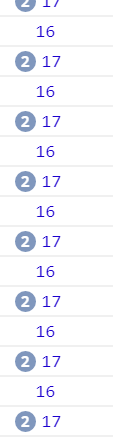

# requestAnimationFrame 
1. 在每一帧重绘之前调用，调用频率与浏览器刷新频率相同
2. requestAnimationFrame 在执行 js 实现的动画时可以减少资源消耗
3. 隐藏或不可见元素 requestAnimationFrame 不会执行，进一步减少资源消耗

简单的讲requestAnimationFrame就是一个以屏幕刷新率间隔时间的定时器，requestAnimationFrame回调函数执行频率紧跟刷新频率且执行在重绘之前。

用 requestAnimationFrame 实现节流 节流（throttle）
```javascript
let animationFrameID = null;
let lastTime = new Date().getTime()
function logTimeDiff(){
const nowTime = new Date().getTime();
    console.log(nowTime - lastTime )
    lastTime = nowTime;
}
function throttle() {
  window.cancelAnimationFrame(animationFrameID);
  animationFrameID = window.requestAnimationFrame(() => {
    logTimeDiff();
    // 动画
  });
}
// 每隔一毫秒调用，而 logTimeDiff 实际执行时间间隔为 （1000/帧率）ms
setInterval(()=>{throttle();},1)

```

> 输出结果如下

* 1000/60 ≈ 16.7 （16.7为屏幕刷新时间，运行环境不同可能会使得屏幕刷新时间不同）



## 使用场景

在 scroll 回调或者 mousemove 回调中执行js实现的动画时，若直接写入其中回调，调用频率将非常之高，资源耗费页较高，
将其写入 requestAnimationFrame 中一方面可以减少调用次数，降低资源耗费，另一方面也可以使得 js 实现动画流畅（因为执行频率紧跟刷新率）

[参考链接](https://developer.mozilla.org/zh-CN/docs/Web/API/Window/requestAnimationFrame)
