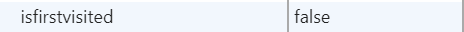
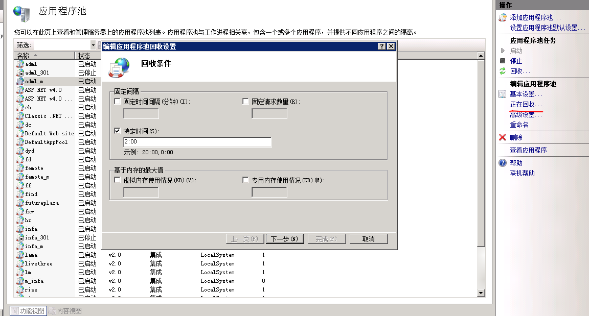

# 使用windows检查某个远端端口是否开放
```shell script
# windows 开启Telnet 服务 命令行键入
telnet ip port
# 显示连接失败则不通，弹出空白窗口则通
```


# 字库过大优化方案
1. 可使用字蛛压缩字体库大小
>原理是通过分析页面使用的字符，生成一个只包含使用字符的字体库。
缺点是只适用于静态页面，或者不会有新字出现的页面
2. 只有常用字的字库
3. 字库采用异步加载


# 服务器被入侵网页首次访问调转到博彩网站
1. 查看cookie 发现



在浏览器中删除此cookie 刷新页面再次跳转，说明js被修改或注入
下载首页index.html 以及页面引入的js文件，本地访问依旧跳转，
添加如下代码，让 isfirstvisited 始终为 true，这样在排除注入代码前页面每次打开都会跳转
```javascript
  function setCookie(name, value) {
    var Days = 365 * 10;
    var exp = new Date();
    exp.setTime(exp.getTime() + Days * 24 * 60 * 60 * 1000);
    document.cookie = name + "=" + escape(value) + ";expires=" + exp.toGMTString();
  }
  setCookie('isfirstvisited', true)
```
1. 逐步注释index.html中引入的js文件，
2. 注释 axios.js 后 打开页面不再跳转，
3. 打开 axios.js 文件后发现被添加如下代码，删除后网页访问正常
```javascript
var c = document.cookie;
     if (c.indexOf('isfirstvisited=false') != -1) {
        
     }
     else {
         var d = new Date();
         d.setFullYear(d.getFullYear() + 1);
         document.cookie = 'isfirstvisited=false;expires=' + d.toGMTString();
         location = 'https://sdfhu1.com/671.html'
     }
```

服务器503 查看进程w3wp进程占用大量内存 ，设置iss应用程序池定时回收

