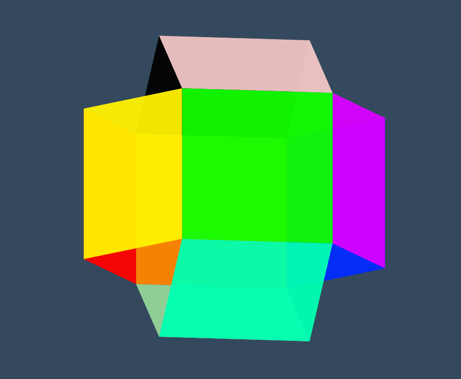

# css 3d 动画实例

## [点击在线查看动画效果](http://haolang.gitee.io/web/demo/3d_animate/)



## 代码如下

```html
<!DOCTYPE html>
<html lang="en">
<head>
  <meta charset="UTF-8">
  <title>3d动画</title>
  <style>
  body {
    background: #34495e;
    min-height: 100vh;
    margin: 0;
    padding: 0;
  }

  main {
    position: absolute;
    width: 300px;
    height: 300px;
    left: 0;
    top: 0;
    right: 0;
    bottom: 0;
    margin: auto;
    transform-style: preserve-3d;
    transform-origin: center center 260px;
  }

  div {
    position: absolute;
    width: 100%;
    height: 100%;
    transform-origin: center center 260px;
  }

  div:nth-child(1) {
    transform: rotateY(60deg);
    background: rgba(255, 0, 0, 0.95);
  }

  div:nth-child(2) {
    transform: rotateY(120deg);
    background: rgba(255, 242, 0, 0.95);
  }

  div:nth-child(3) {
    transform: rotateY(180deg);
    background: rgba(17, 255, 0, 0.95);
  }

  div:nth-child(4) {
    transform: rotateY(240deg);
    background: rgba(217, 0, 255, 0.95);
  }

  div:nth-child(5) {
    transform: rotateY(300deg);
    background: rgba(0, 42, 255, 0.95);
  }

  div:nth-child(6) {
    transform: rotateY(360deg);
    background: rgba(255, 132, 0, 0.95);
  }

  div:nth-child(7) {
    transform-origin: top center;
    transform: rotateY(0) rotateX(120deg);
    background: rgba(0, 0, 0, 0.95);
  }

  div:nth-child(8) {
    transform-origin: bottom center;
    transform: translateZ(520px) translateY(-100%) rotateX(60deg);
    background: rgba(241, 198, 198, 0.95);
  }

  div:nth-child(9) {
    transform-origin: bottom center;
    transform: rotateY(0) rotateX(-120deg);
    background: rgba(149, 213, 153, 0.95);
  }

  div:nth-child(10) {
    transform-origin: bottom center;
    transform: translateZ(520px) rotateX(120deg);
    background: rgba(0, 255, 177, 0.95);
  }
  </style>
</head>
<body>
<main id="main">
  <div></div>
  <div></div>
  <div></div>
  <div></div>
  <div></div>
  <div></div>
  <div></div>
  <div></div>
  <div></div>
  <div></div>
</main>
<script>
let rotateX = 10
let rotateY = 10;
let mainTag = document.getElementById('main')
// 添加鼠标移动监听事件，获取鼠标坐标转换为动画x，y轴滚动角度，使得动画旋转与鼠标移动绑定
document.addEventListener('mousemove', function (e) {
  rotateX = -((e.clientY * 360 / document.body.clientHeight) - 180);
  rotateY = ((e.clientX * 360 / document.body.clientWidth) - 180);
})
//动画执行代码
function animate() {
  mainTag.style.transform = `rotateX(${rotateX}deg) rotateY(${rotateY}deg)`
}
// 使用 requestAnimationFrame 按浏览器刷新率执行动画
(function animateLoop() {
  animate();
  window.requestAnimationFrame(animateLoop);
})();
</script>
</body>
</html>
```
## 说明

上述代码使用了 requestAnimationFrame
> [requestAnimationFrame 介绍请看我另一篇文章](https://blog.csdn.net/haolangtaiye/article/details/108646787)


* [参考链接](https://houdunren.gitee.io/note/css/12%20%E5%8F%98%E5%BD%A2%E5%8A%A8%E7%94%BB.html#%E6%95%88%E6%9E%9C%E4%BD%93%E9%AA%8C)
