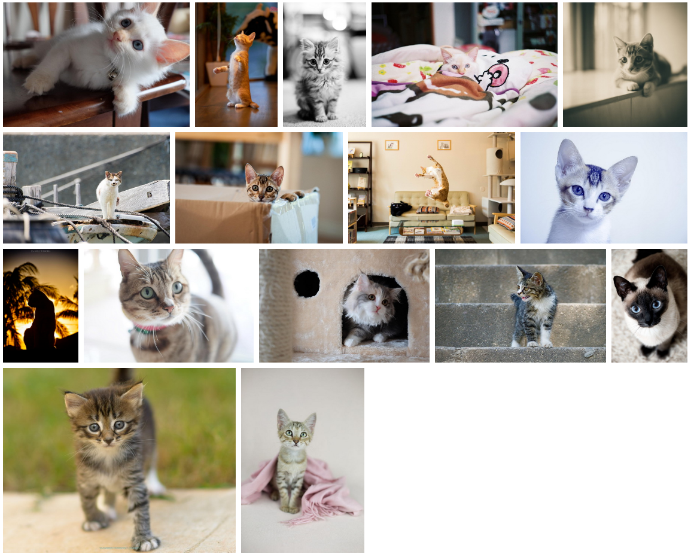

## 布局特点
1. 代码简单，完整代码仅仅75行
2. 图片完整展示，不会被裁切，等比缩放，而非拉伸
3. 以图片异步加载结束时间的顺序渲染图片，防止页面过大闪动
4. 最后一行图片过少时，图片正常显示，不会缩放占满整行


**tips: github 图片加载较慢正好可以观察图片加载渲染过程**

[在线预览(github) https://haolang.github.io/web/demo/500px/](https://haolang.github.io/web/demo/500px/)

[在线预览(gitee) http://haolang.gitee.io/web/demo/500px/](http://haolang.gitee.io/web/demo/500px/)

> 效果如下



> 代码如下

```html 
<!DOCTYPE html>
<html lang="en">
<head>
  <meta charset="UTF-8">
  <title>完美flex横向瀑布流布局</title>
  <script src="https://cdn.jsdelivr.net/npm/vue/dist/vue.js"></script>
  <style>
  .primary {
    display: flex;
    flex-wrap: wrap;
  }
  /*占位元素，最后一行图片过少时，图片不缩放*/
  .primary::after {
    content: '';
    flex-grow: 999999999;
    min-width: 200px; /* 图片可以占满一行时保证换行，否则最后一行末尾可能会出现一小段空白 */
    height: 0;
  }
  .image-box {
    margin: 5px;
    display: block;
  }
  .image-box img {
    display: block;
    width: 100%;
  }
  </style>
</head>
<body>
<div id="app" class="primary">
  <div
    v-for="(image,key) in imageArraySize"
    :key="key"
    class="image-box"
    :style="{
      width: `${image.width * 200 / image.height}px`,
      flexGrow: image.width / image.height * 1000
    }"
  >
    
  </div>
</div>
</body>
<script>
new Vue({
  el: '#app',
  data() {
    return {
      imagesBaseUrl: './images',
      imageArraySize: []
    }
  },
  methods: {
    getImageSize(imageSrc) {
      let img = new Image();
      img.src = imageSrc;
      //获取图片尺寸
      img.onload = () => {
        this.imageArraySize.push({
          src: img.src,
          width: img.width,
          height: img.height
        });
      }
    }
  },
  mounted() {
    for (let i = 0; i < 28; i++) {
      const imageSrc = `${this.imagesBaseUrl}/i${i}.jpg`;
      this.getImageSize(imageSrc);
    }
  }
})
</script>
</html>
```

      
> 图片容器 image-box style 解释

1. width: `${image.width * 200 / image.height}px` 保证图片高度以200px为基准

2. flexGrow: image.width/image.height * 1000 这行代码(image.width / image.height )部分可以理解为 (image.width/image.height) / (image.height/image.height) 
即图片的高宽同时除以高度，图片高度均为1时，图片宽度即为整行所占比，即flex-grow的值,
结果乘以1000 防止 flex-grow 的值小于1，当浏览器窗口很窄时,一张图片单独占据一行,若 flex-grow 小于1会，导致图片收缩不能占满一行


## 缺点

1. 由于本例中图片异步加载的原因，图片每次渲染的顺序可能不一致，最先传输完成的图片最先显示
2. 本文示例代码使用异步加载完成时间顺序加载图片，一行图片加载结束前，无法提前预知此行的最终高度，每一行在加载时依旧有小幅页面闪动，但已加载完成的行，不会再闪动。

## 其他方案

#### 1. 加载图片显示顺序始终一致,页面无大幅闪动
本例可以容易的修改图片为同步加载，但得不偿失，图片一张加载完毕再加载下一张，加载速度会变慢

#### 2. 加载图片显示顺序始终一致,且不影响图片加载速度
想要保证图片顺序一致，this.imageArraySize.push 修改为通过索引 this.imageArraySize[i] 添加数据即可但是由于图片不断插入导致回流与重构，会导致页面在图片加载完毕之前不断闪动。

> 参考链接中的方案使用后台图片尺寸数据占位，防止页面闪动

[参考链接](https://github.com/xieranmaya/blog/issues/4)

