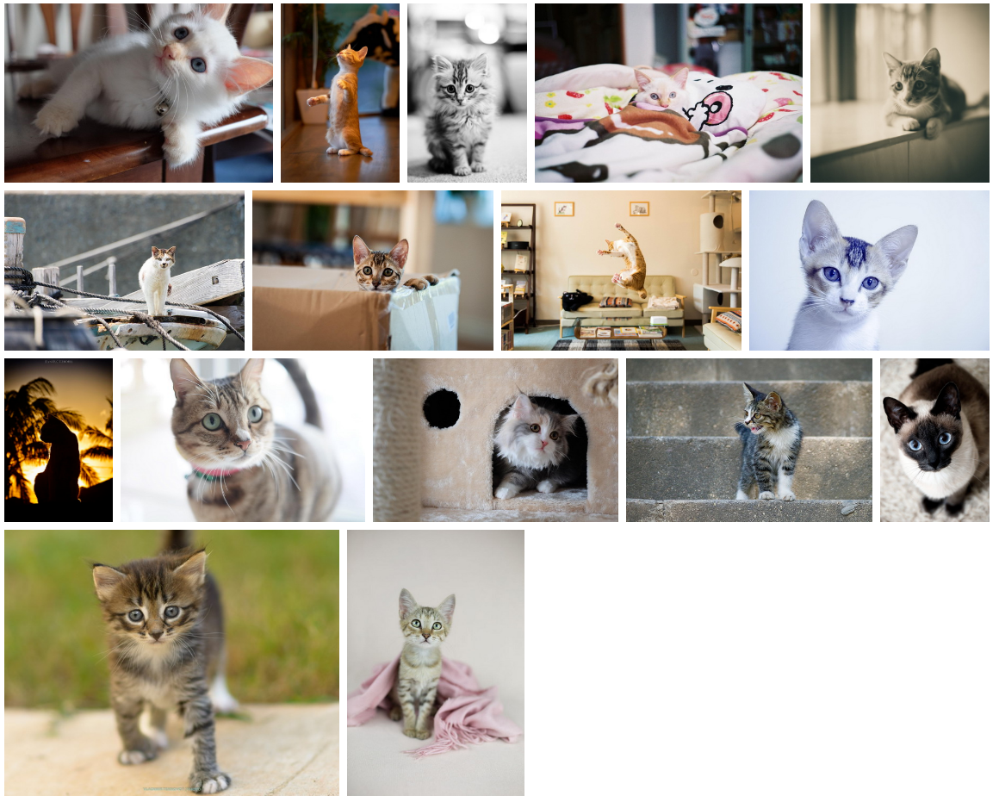

# flex 完美实现 横向瀑布流 页面布局

## 布局特点
1. 代码简单
2. 图片完整展示，不会被裁切
3. 以图片异步加载结束时间的顺序渲染图片，防止页面闪动
4. 最后一行图片过少时，图片不会被放大得很大


[在线预览 https://haolang.github.io/web/demo/500px/](https://haolang.github.io/web/demo/500px/)

> 效果如下



> 代码如下

```html 
<!DOCTYPE html>
<html lang="en">
<head>
  <meta charset="UTF-8">
  <title>Title</title>
  <script src="https://cdn.jsdelivr.net/npm/vue/dist/vue.js"></script>
  <style>
  .primary {
    display: flex;
    flex-wrap: wrap;
  }

  .image-box {
    /*flex-grow: 1;*/
    margin: 5px;
    display: block;
  }

  .image-box img {
    display: block;
    width: 100%;
  }

  .image-box.placeholder {
    width: 300px;
    height: 0;
    margin: 0;
  }
  </style>
</head>
<body>
<div id="app" class="primary">
  <div
    v-for="(image,key) in imageArraySize"
    :key="key"
    class="image-box"
    :style="{
      width: `${image.width * 200 / image.height}px`,
      flexGrow: image.width/image.height
    }"
  >
    
  </div>
  <!--    占位元素，使得视觉上最后一行实际上不是最后一行,防止最后一行图片过少时，图片被放大过大-->
  <div v-for="n in 5" class="image-box placeholder"></div>

</div>
</body>
<script>
new Vue({
  el: '#app',
  data() {
    return {
      imagesBaseUrl: './images',
      imageSum: 28,
      imageArraySize: []
    }
  },
  methods: {
    getImageSize(imageSrc) {
      let img = new Image();
      img.src = imageSrc;
      //获取图片尺寸
      img.onload = () => {
        this.imageArraySize.push( {
          src: img.src,
          width: img.width,
          height: img.height
        });
      }
    }
  },
  mounted() {
    for (let i = 0; i < this.imageSum; i++) {
      const imageSrc = `${this.imagesBaseUrl}/i${i}.jpg`；
      this.getImageSize(imageSrc);
    }
  }
})
</script>
</html>

```

      
> 图片容器 image-box style 解释

1. width: `${image.width * 200 / image.height}px` 保证图片高度以200px为基准

2. flexGrow: image.width/image.height 这行代码可以理解为 (image.width/image.height)/(image.height/image.height)
即图片的高宽同时除以高度，图片高度均为1时，图片宽度即为整行所占比，及flex-grow的值


## 缺点

1. 由于图片异步加载的原因，图片每次渲染的顺序可能不一致
2. 可以使用同步加载图片的方式使得每次图片渲染的顺序一致，但是会导致图片一张张加载，加载速度可能会变慢
3. 想要保证图片顺序一致，同时图片异步加载此方案也可以实现，但是由于图片不断插入撑开容器，会导致页面在图片加载完毕之前不断闪动。

> 参考链接中的方案使用后台图片尺寸数据占位，防止页面闪动

[参考链接](https://github.com/xieranmaya/blog/issues/6)

[参考demo](https://jsbin.com/tisaluy/6/edit?html,css,output)
