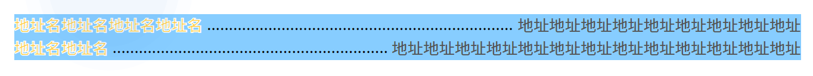

> # 以下方案均基于flex布局

# 设计图如下，文案部分由后台加载长短不一


# 分析
1. 设计层次分为背景的文案部分
2. 文案部分分为地址名，地址，和中间虚线部分
3. 难以处理的是中间虚线部分要根据两边文案长度的不同显示不同长度

# 方案一 （最外层背景为纯色可以使用此方案）
1. 假设最外层背景色为 blue
2. 地址名和地址设为 inline-block，背景色同样设置为blue
3. 中间虚线部分使用一个虚线点的图片作为文案父元素的背景，在x轴上铺开

#方案2 
1. 文案父元素使用flex布局，子元素两端对齐
2. 中间虚线部分使用超过最大宽度的 .... 文本，超出部分隐藏

>  效果如下
 

代码如下
```html
<template>
  <div class="main-container">
    <div class="address-unit">
      <div class="address-item">
        <span class="name">地址名地址名地址名地址名</span>
        <span class="dot-dash">
          ........................................................................................................................................................................................................................................................................................................................................................................................................................................................................................................................
        </span>
        <span class="address">地址地址地址地址地址地址地址地址地址</span>
      </div>
      <div class="address-item">
        <span class="name">地址名地址名</span>
        <span class="dot-dash">
          ........................................................................................................................................................................................................................................................................................................................................................................................................................................................................................................................
        </span>
        <span class="address"
          >地址地址地址地址地址地址地址地址地址地址地址地址地址</span
        >
      </div>
    </div>
  </div>
</template>

<script>
export default {
  name: "demo"
};
</script>

<style lang="scss" scoped>
.main-container {
  width: 1200px;
  margin: 100px auto;
  background: #87cdff;
}
.address-unit {
  .address-item {
    width: 100%;
    box-sizing: border-box;
    display: inline-flex;
    justify-items: stretch;
    justify-content: space-between; // 两端对齐布局
    font-size: 24px;
    .name {
      font-weight: bold;
      color: #ffcb3e;
      -webkit-text-stroke: 1px #fff; // 文字描边
      white-space: nowrap;
    }
    .dot-dash {
      overflow: hidden; //超出部分隐藏
      line-height: 24px; // 使得虚线居中
      padding-left: 6px;
    }
    .address {
      color: #545454;
      text-align: right;
      white-space: nowrap;
      padding-left: 6px;
    }
  }
}
</style>

```
