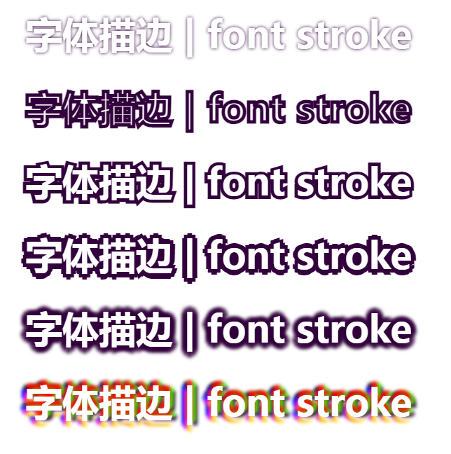

# 纯css实现自定义文字描边

## 实现原理
1. 利用 text-shadow 可叠加的属性在同一半径内叠加多个 文字阴影实现，叠加出现的锯齿使用 text-shadow 模糊属性弱化
2. 叠加的 text-shadow 越多，text-shadow 的边缘越平滑，本例中 text-shadow 每间隔45度叠加一次，共叠加8次（叠加8次时 text-shadow的 x y轴平移距离较易计算） 。

## 效果展示

[点击查看在线示例](https://haolang.gitee.io/web/demo/font_stroke/)



## 示例代码

```html
<!DOCTYPE html>
<html lang="en">
<head>
  <meta charset="UTF-8">
  <title>纯css 实现字体描边</title>
  <style>
  .text {
    text-align: center;
    font-size: 42px;
    line-height: 2;
    color: #fff;
    font-weight: bold;
  }

  .native-text-shadow {
    text-shadow: 0 0 4px #32003C;
  }

  .native-webkit-text-stroke {
    -webkit-text-stroke: 4px #32003C;
  }
  .improve-webkit-text-stroke {
    -webkit-text-stroke: 8px #32003C;
    position: relative;
    z-index: 1;
  }
  .improve-webkit-text-stroke:after {
    content: "字体描边 | font stroke";
    color: #fff;
    position: absolute;
    z-index: 2;
    left: 0;
    right: 0;
    top: 0;
    -webkit-text-stroke-width: 0;
  }

  /*没有模糊的字体阴影*/
  /*上，右移动6px则 右上移动距离x,y 轴移动距离应该为 4px （6 / √2 ≈ 4.23 对角线长度为6的正方形的边长）  */
  .text-stroke-no-blur {
    text-shadow: 6px 0 0 #32003C,
    -6px 0 0 #32003C,
    0 6px 0 #32003C,
    0 -6px 0 #32003C,
    4px 4px 0 #32003C,
    -4px 4px 0 #32003C,
    4px -4px 0 #32003C,
    -4px -4px 0 #32003C;
  }

  .text-stroke {
    text-shadow: 0 -6px 4px #32003C, /*上*/
    4px -4px 4px #32003C, /*右上*/
    6px 0 4px #32003C, /*右*/
    4px 4px 4px #32003C, /*右下*/
    0 6px 4px #32003C, /*下*/
    -4px 4px 4px #32003C, /*左下*/
    -6px 0 4px #32003C, /*左*/
    -4px -4px 4px #32003C; /*左上*/
  }

  .text-stroke-colours {
    text-shadow: 0 -6px 4px #ff0000, /*上*/
    4px -4px 4px #46ff00, /*右上*/
    6px 0 4px #32003c, /*右*/
    4px 4px 4px #ffffff, /*右下*/
    0 6px 4px #ffd500, /*下*/
    -4px 4px 4px #ee00ff, /*左下*/
    -6px 0 4px #0021ff, /*左*/
    -4px -4px 4px #000000; /*左上*/
  }
  </style>
</head>
<body>
<div class="native-text-shadow text">
  字体描边 | font stroke
</div>
<div class="native-webkit-text-stroke text">
  字体描边 | font stroke
</div>
<div class="improve-webkit-text-stroke text">
  字体描边 | font stroke
</div>
<div class="text-stroke-no-blur text">
  字体描边 | font stroke
</div>
<div class="text-stroke text">
  字体描边 | font stroke
</div>
<div class="text-stroke-colours text">
  字体描边 | font stroke
</div>
</body>
</html>
```

tips： 本例中的 text-stroke 使用scss或less可以容易的函数化，方便直接调用使用
> scss 示例
```scss
/** 
* 文字描边
*
* @param $width  文字描边宽度
* @param $blur   文字描边模糊距离 
* @param $color  文字描边颜色
*/
@mixin font-stroke($width,$blur, $color) {
    $obliqueWidth: $width * 1.414;
    text-shadow: 0 -$width $blur $color, /*上*/
    $obliqueWidth -$obliqueWidth $blur $color, /*右上*/
    $width 0 $blur $color, /*右*/
    $obliqueWidth $obliqueWidth $blur $color, /*右下*/
    0 $width $blur $color, /*下*/
    -$obliqueWidth $obliqueWidth $blur $color, /*左下*/
    -$width 0 $blur $color, /*左*/
    -$obliqueWidth -$obliqueWidth $blur $color; /*左上*/
}

//调用
.text {
  //结果与示例代码中 text-stroke 相同
  @include font-stroke(6px, 4px, #32003C)
}

```


## 缺点
不能实现没有模糊且平滑的描边，没有模糊的描边会有锯齿感

## 背景
搜索纯css文字描边未找到理想的实现方案，大多都是说使用 text-shadow 或 -webkit-text-stroke ，
-webkit-text-stroke 的描边会同时向内和向外扩张文字看起来会变细，而  text-shadow 大小与原字体一样，直接使用无法实现描边，想到 box-shadow 可以叠加,搜索发现text-shadow 也可以叠加， 那么在多个方向上以一定偏移量多次叠加 text-shadow 不就是文字描边了吗，8个方向上叠加后8个文字阴影后有锯齿，总不能继续叠加更多的文字阴影消除锯齿，使用 text-shadow 的模糊属性消除锯齿即可。

## 更新

突然想到 -webkit-text-stroke 同时向内和向外扩张，利用没用 -webkit-text-stroke 相同字符的伪元素覆盖在有 -webkit-text-stroke 的字体之上看上去不就是只有向外扩张的描边了嘛
实现看上面代码 css .improve-webkit-text-stroke 部分

不过 -webkit-text-stroke 只能在webkit内核浏览器使用存在兼容性问题，而且 .improve-webkit-text-stroke 实现方法，文字改变得同步改变其伪元素文本内容（可用js改进）
