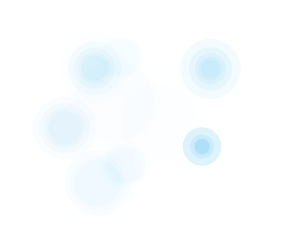
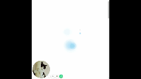

# 效果展示



# 思路要点
1. 通过向数组 waves push操作插入水波纹相关数据，使用 vue v-for 动态更新 waves 生成水波纹数据
2. 水波纹使用fixed定位通过点击事件的 clientX 和 clientY属性 映射水波纹dom 的 top，left 属性
3. 水波纹使用 scale 放大作为扩散效果，从内到外放大倍数指数增长，模拟波纹越来越大的效果，使用 opacity 属性实现渐淡效果
5. 定义水波纹各圈初始状态，总体过渡到 scale(1), opacity: 0;并保持此最终状态；
6. 点击次数的增加会使得dom逐渐增长，每隔一定时间检测是否有点击，若没有则清空 waves数组
7. 随机产生波纹大小数据，丰富波纹效果

# 使用
在App.vue 中引用即可

# 代码如下
```vue
//waves.vue
<template>
  <div data-tname="WaveItem">
    <div class="main-container">
      <div class="waves">
        <div class="wave" v-for="(item, key) in waves" :key="key" :style="item">
          <div
            v-for="n in wavesConfig.total"
            :key="n"
            class="wave-item"
            :style="{
              transform: `scale(${0.1 * Math.sqrt(n - 1)})`, // 使得波纹大小指数增长
              opacity: 0.3 * (1 / n), // 因为相互层叠的波纹透明度会相互叠加，需要越小的波纹透明度越低，以免中心颜色过重
              animationDelay: `${(n - 1) * 0.12}s`, // 越大的波纹越晚出现，以呈现波纹逐渐扩散的效果
              animationDuration: `${0.6 +
                n * 0.3 +
                parseInt(item.width) * 0.002}s`, // 波纹动画时间渐增，表现波纹向外扩散渐慢的效果,波纹尺寸越大动画时间越长。
              backgroundColor: wavesConfig.waveColor
            }"
          ></div>
        </div>
      </div>
    </div>
  </div>
</template>

<script>
export default {
  name: "WaveItem",
  data() {
    return {
      waves: [],
      wavesConfig: {
        maxSize: 300, // px，波纹最大尺寸
        minSize: 100, // px，波纹最小尺寸
        zIndexCount: 999, // 波纹父元素其z-index数值
        waveColor: "#3E8CE3", //波纹基础颜色
        total: 5 //波纹圈层数
      },
      clear: {
        delay: 5000,
        timeoutId: null
      }
    };
  },
  mounted() {
    document.getElementById("app").onclick = e => {
      this.createWave(e);
      this.intervalClearWave();
    };
  },
  methods: {
    createWave(e) {
      // 让新生成的波纹始终在之前波纹的上层产生叠加效果
      if (this.wavesConfig.zIndexCount > 99999) {
        this.wavesConfig.zIndexCount = 999;
      } else {
        this.wavesConfig.zIndexCount++;
      }
      // 在一定范围内随机生成波纹的大小
      const waveSize = parseInt(
        Math.random() * (this.wavesConfig.maxSize - this.wavesConfig.minSize) +
          this.wavesConfig.minSize
      );
      //添加新的波纹数据
      this.waves.push({
        left: `${e.clientX - waveSize / 2}px`,
        top: `${e.clientY - waveSize / 2}px`,
        zIndex: this.wavesConfig.zIndexCount,
        width: `${waveSize}px`,
        height: `${waveSize}px`
      });
    },
    intervalClearWave() {
      clearTimeout(this.clear.timeoutId);
      this.clear.timeoutId = setTimeout(() => {
        this.waves = [];
      }, this.clear.delay);
    }
  }
};
</script>

<style lang="scss" scoped>
.waves {
  .wave {
    position: fixed;
    pointer-events: none; // 点击事件穿透，使得鼠标点击可以穿透波纹，兼容ie11及以上
    @keyframes wave {
      to {
        //波纹逐渐扩散变大变透明
        transform: scale(1);
        opacity: 0;
      }
    }
    .wave-item {
      width: 100%;
      height: 100%;
      position: absolute;
      border-radius: 100%;
      animation: {
        name: wave;
        fill-mode: forwards; // 动画结束后保持最后一帧的状态
        timing-function: ease-out; // 波纹向外扩散渐缓
      }
    }
  }
}
</style>


```
