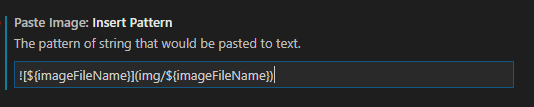
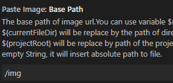
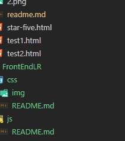

### 新建html文件，快速创建模板
在空白html文件中输入 "!" 然后按Tab键


### 快捷键
自定义快捷键
1. 命令模式
ctrl + alt + p

### 借助paste image 插件 以github作为图床粘贴图片
1. 在github和本地均可以使用相对地址展示图片

- paste image 插件设置如下



其他地方默认设置

- 粘贴时自动生成如下格式文本
```

```

