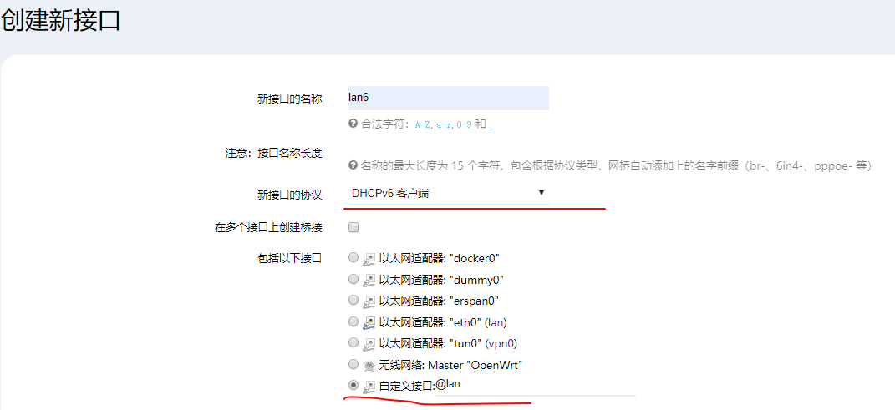
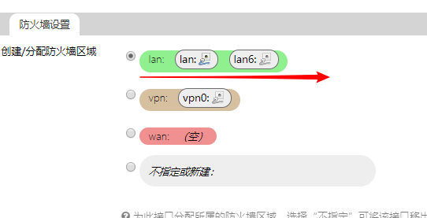
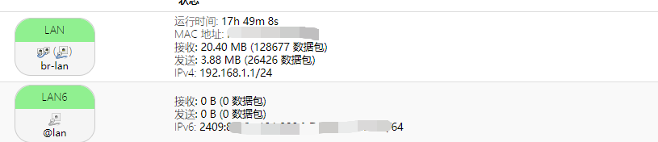
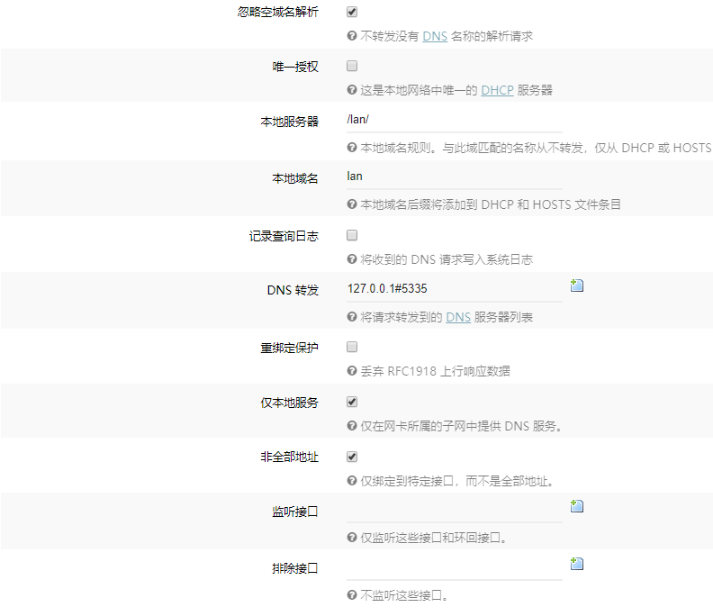
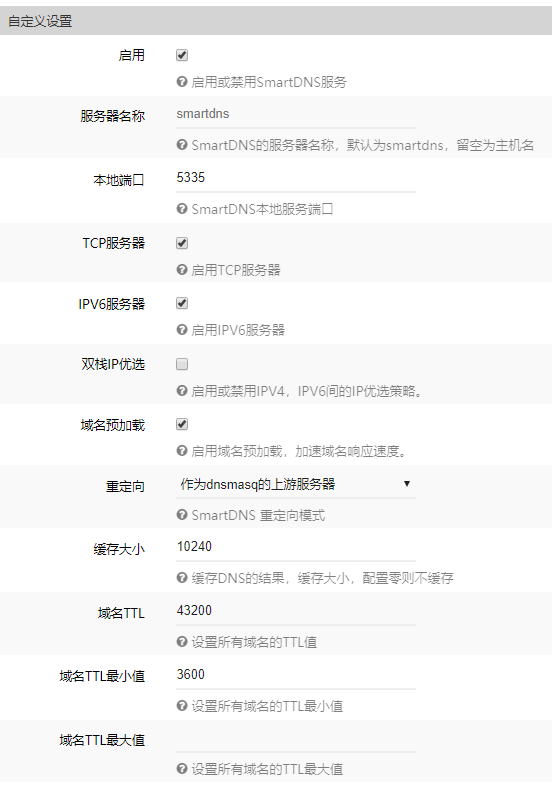
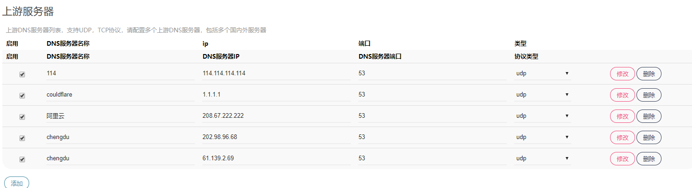
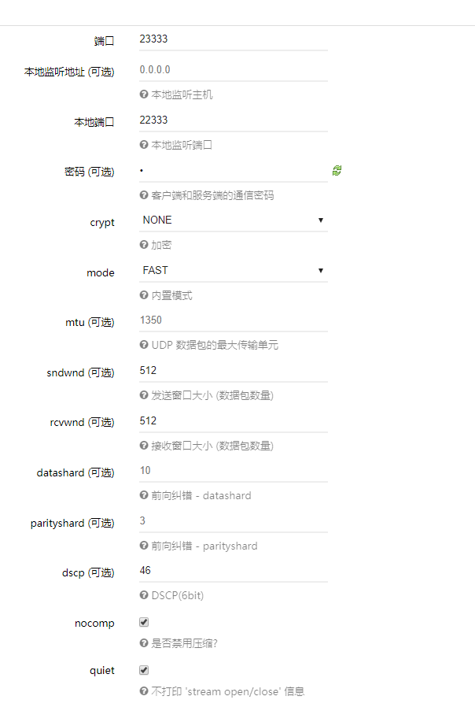
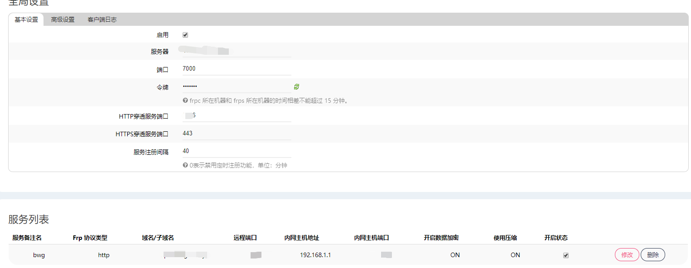

# 斐讯 n1 

## 刷机包

[f大版本](https://www.right.com.cn/forum/forum.php?mod=viewthread&tid=981406&extra=page%3D1%26filter%3Dtypeid%26typeid%3D21)

## 旁路由 ipv6 配置 

接口页面点击添加接口，创建新接口，名字随意，配置如图



提交后其他默认，防火墙设置选择 lan



保存应用后，上级ipv6服务配置没有问题的话，稍等片刻即可获取到ipv6


此时使用openwrt可以ping通ipv4但是无法ping通ipv6 ，使用获得的ipv6地址又可以访问openwrt。
那么就很有可能是上游服务提供商屏蔽了相关端口。
修改默认端口80为8080后就可以使用外网ipv6正常访问

## 修改openwrt默认访问端口
```shell script
vi /etc/config/uhttp
#修改端口为 8888
/etc/init.d/uhttpd restart
```


## 配置smartDNS
DNS配置






## kcptun




### 使用以下命令获取本地ipv6地址  
```
ifconfig -a br-lan |grep inet6|grep Global|grep -v /60|awk '{print $3}'|awk -F/ '{print $1}'
```
```shell script
ifconfig -a br-lan  //获取br-lan接口的ipv6地址
awk '{print $3}'    //grep Global 获取带有Global字样的行
grep -v /60        //删除带有 /60 的行,即本地ipv6地址
awk '{print $3}'   // 使用空格或tab分割字符串并取得分割后的第三个部分
awk -F/ '{print $1}'   // 使用 / 分割字符串获取第一部分
```

>执行shell脚本，出现Syntax Error "elif" unexpected (expecting then)
```shell script
sed -i 's/\r//' filename #转换为Unix格式即可
```

## 利用 CloudFlare API 实现自动 DDNS 功能|支持IPv4|IPv6
### 参考链接：
 - [shell脚本参考](https://vircloud.net/operations/cf-ddns.html)
 - [cloudflare官方api文档](https://api.cloudflare.com/#getting-started-resource-ids)


### 代码如下
```shell script
#!/bin/bash
auth_email="youemail@mail.com"
auth_key="*********"
record_name="example.com"
# ipv6 为 AAAA记录 ，ipv4 为 A 记录
record_type="AAAA"

# ip 的获取要根据实际情况修改 
ip=$(ifconfig br-lan |grep inet6|grep Global|grep -v /60|awk '{print $3}'|awk -F/ '{print $1}')
ip_file="ip.txt"

# 判断 IP 是否变化
old_ip=$(cat $ip_file)
if [ "$ip" == "$old_ip" ]; then
    echo "IP has not changed."
    exit 0
fi

zone_identifier=$(curl -s -X GET "https://api.cloudflare.com/client/v4/zones" -H "X-Auth-Email: $auth_email" -H "X-Auth-Key: $auth_key" -H "Content-Type: application/json" | awk -F , '{print $1}' | awk -F \" '{print $6}' )
record_identifier=$(curl -s -X GET "https://api.cloudflare.com/client/v4/zones/$zone_identifier/dns_records?name=$record_name&type=$record_type" -H "X-Auth-Email: $auth_email" -H "X-Auth-Key: $auth_key" -H "Content-Type: application/json" | grep \"id\" | awk -F \" '{print $4}')
echo "$zone_identifier" > $id_file
echo "$record_identifier" >> $id_file
curl -s -X PUT "https://api.cloudflare.com/client/v4/zones/$zone_identifier/dns_records/$record_identifier" -H "X-Auth-Email: $auth_email" -H "X-Auth-Key: $auth_key" -H "Content-Type: application/json" --data "{\"id\":\"$zone_identifier\",\"type\":\"$record_type\",\"name\":\"$record_name\",\"content\":\"$ip\"}"
# 保存变化后的ip
echo "$ip" > $ip_file
```

### openwrt 添加计划任务
```shell script

# openwrt 192.168.1.1/cgi-bin/luci/admin/system/crontab
#每30分钟执行一次，执行结果写入cloudflare.log
*/30 * * * *  ./dfDNS.sh >> cloudflare.log
```

> 修改前错误出现错误:API UPDATE FAILED. DUMPING RESULTS
```shell script
if [ -f $id_file ] && [ $(wc -l $id_file | cut -d " " -f 1) == 2 ]; then
    zone_identifier=$(head -1 $id_file)
    record_identifier=$(tail -1 $id_file)
else
#若不删除上面部分会出现以下错误提示，原因未知
API UPDATE FAILED. DUMPING RESULTS:
{"success":false,"errors":[{"code":7003,"message":"Could not route to \/zones\/dns_records, perhaps your object identifier is invalid?"},{"code":"7000","message":"No route for that URI"}],"messages":[],"result":null}
```

### 梅林 添加计划任务
[参考链接](https://github.com/RMerl/asuswrt-merlin.ng/wiki/User-scripts)


在 /jffs/scripts/init-start 中添加

```shell script
#!/bin/sh
# 每30分钟运行一下 cfDNS.sh 脚本 运行结果存储到  cloudflare.log 中
cru a cfddns "*/30 * * * * /jffs/ddns/cfDNS.sh >> /jffs/ddns/cloudflare.log"
```
```shell script
# 没有 init-start 则新建，并修改权限 
chmod a+rx /jffs/scripts/init-start
```

### frp 内网穿透使得可以使用ipv4 访问软路由
[参考链接](https://github.com/fatedier/frp/blob/master/README_zh.md)


